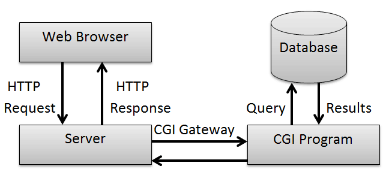
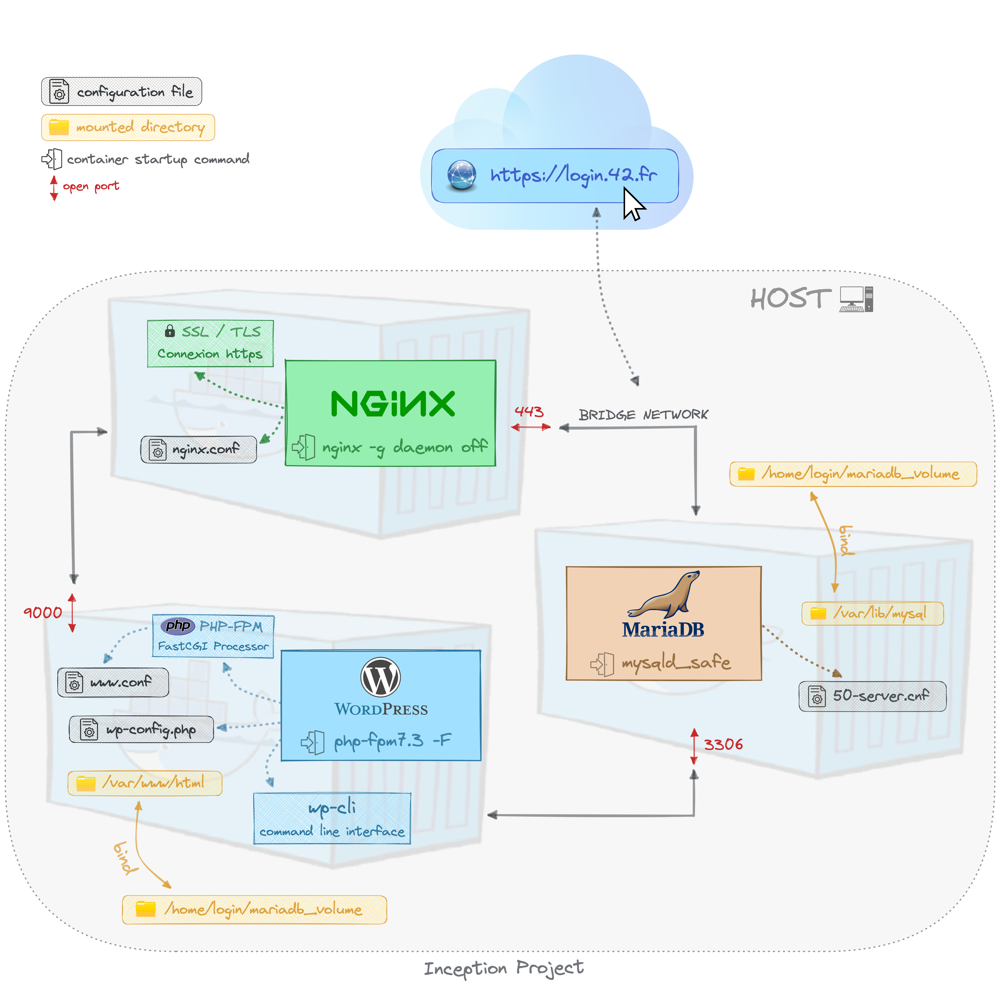

# Inception (42)

Docker-based WordPress stack built with **Docker Compose**.

This repository runs a HTTPS Nginx reverse-proxy in front of:
- WordPress (PHP-FPM)
- MariaDB

And includes bonus services:
- Redis (WordPress object cache)
- Adminer
- Portainer
- FTP server (vsftpd)
- A static page served under `/static/`

> Note: the current compose file includes the bonus services by default.

---

## Services

All services are defined in `srcs/docker-compose.yml`.

| Service | Container | Purpose | Exposed | URL / Notes |
|---|---:|---|---:|---|
| Nginx | `nginx` | TLS termination + reverse proxy | `443/tcp` | `https://$DOMAIN_NAME/` |
| WordPress | `wordpress` | PHP-FPM + WP-CLI bootstrap | internal | Served through Nginx |
| MariaDB | `mariadb` | Database | internal | Data persisted on host |
| Redis | `redis` | Cache backend | internal | Password protected |
| Static page | `static-page` | Nginx serving `index.html` | internal | `https://$DOMAIN_NAME/static/` |
| Adminer | `adminer` | DB UI | internal | `https://$DOMAIN_NAME/adminer` |
| Portainer | `portainer` | Docker UI | internal | `https://$DOMAIN_NAME/portainer/` |
| FTP | `ftp_server` | File access to WP volume | `21/tcp`, `21100-21110/tcp` | Uses `$FTP_USER` + secret password |

---

## Prerequisites

- Linux host with **Docker** and **Docker Compose (v2)** installed
- `make`
- A domain name that resolves locally (or `/etc/hosts` entry)

---

## Configuration

### 1) Environment file

The stack reads its configuration from `srcs/.env`.

Current keys:

```env
DOMAIN_NAME=...
MYSQL_HOSTNAME=mariadb
MYSQL_DATABASE=wordpress
MYSQL_USER=...
WP_ADMIN_EMAIL=...
WP_SECOND_USER=...
WP_SECOND_EMAIL=...
FTP_USER=...
```

Important: Nginx uses a hard-coded `server_name` in `srcs/requirements/nginx/conf/nginx.conf`. If you change `DOMAIN_NAME`, update that `server_name` too.

### 2) Docker secrets (passwords)

Passwords are provided as Docker secrets from the `secrets/` directory:

- `secrets/db_root_password.txt`
- `secrets/db_password.txt`
- `secrets/wp_second_password.txt`
- `secrets/redis_password.txt`
- `secrets/ftp_password.txt`
- `secrets/portainer_password.txt`
- `secrets/adminer_password.txt`

Notes:
- WordPress admin user is **`$MYSQL_USER`** and the password is read from `db_root_password.txt`.
- Portainer is started with `--admin-password-file`; Portainer expects a **bcrypt hash** in that file.

### 3) Persistent data directories (bind mounts)

Compose binds volumes to these host paths:

- `/home/yrafai/data/mysql`
- `/home/yrafai/data/wordpress`
- `/home/yrafai/data/portainer`

If your username is not `yrafai`, either:
- create these directories, **or**
- edit the `device:` paths under `volumes:` in `srcs/docker-compose.yml` to match your machine.

Example (create directories):

```bash
sudo mkdir -p /home/yrafai/data/{mysql,wordpress,portainer}
sudo chown -R $USER:$USER /home/yrafai/data
```

### 4) Local DNS (/etc/hosts)

To access `https://$DOMAIN_NAME` locally, map the domain to localhost:

```bash
sudo sh -c 'echo "127.0.0.1  yrafai.42.fr" >> /etc/hosts'
```

---

## Usage

The `Makefile` is a thin wrapper around:

```bash
docker compose -f srcs/docker-compose.yml ...
```

### Start

```bash
make
```

### Stop

```bash
make down
```

### Rebuild

```bash
make build
make re
```

### Full cleanup (containers + volumes + images)

```bash
make fclean
```

---

## Access

- WordPress: `https://$DOMAIN_NAME/`
- Static page: `https://$DOMAIN_NAME/static/`
- Adminer: `https://$DOMAIN_NAME/adminer`
- Portainer: `https://$DOMAIN_NAME/portainer/`
- FTP:
  - host: `$DOMAIN_NAME` (or `127.0.0.1`)
  - port: `21`
  - passive ports: `21100-21110`
  - user: `$FTP_USER`
  - password: from `secrets/ftp_password.txt`

TLS is self-signed (generated at runtime inside the Nginx container), so your browser will warn you.

---

## Quick troubleshooting

- If you get 404/host mismatch on TLS: verify `DOMAIN_NAME` in `srcs/.env` and `server_name` in `srcs/requirements/nginx/conf/nginx.conf`.
- If volumes fail to mount: update the `device:` paths in `srcs/docker-compose.yml` or create the directories with correct permissions.
- To inspect logs: `docker compose -f srcs/docker-compose.yml logs -f --tail=200`
<br/> <br/> <br/>

<br/> <br/>
</p>

If you look at a website these days, a server with only HTML documents cannot run the site. HTML file management, high-speed data processing, user-entered data storage, etc. were impossible with a web server that processes static HTML files, and so it appeared. that is CGI.

CGI exists between these web servers (Nginx, Apache) and PHP and Python to transmit and process data to each other with standardized promises . It's possible.

<br/> <br/> <br/>

<br/> <br/>
</p>
In this CGI, if the information requested by the user is not a static HTML file, but a request comes from PHP or Python, the web server knows that it cannot process it and requests the PHP interpreter to read and process the PHP script written by the developer. The result is returned to the web server, which in turn returns it to the browser.

### Limitations of CGI

Now, as services get bigger and bigger, CGI is also reaching its limits.

CGI creates a process whenever it is requested, and while the process is running, it consumes system resources. Also, if many requests occur at the same time, the process is created and a load is generated on the server.

### Fast Common Gateway Interface (FastCGI)

It was inefficient on the server due to the load problem of CGI. As a solution, FastCGI is a technology that evolved CGI. It has been standard for over 20 years, and most web servers (Nginx, IIS, Apache) provide FastCGI function.

FastCGI handles multiple requests by creating one large process instead of creating a process for each request like the existing CGI.

In addition, it is possible to separate the web server and PHP by establishing a PHP server at the back end through socket communication with FastCGI. This is called WAS (Web Application Server) .

## flowchart
<br/> <br/> <br/>

<br/> <br/>
</p>

## installation
  1. Clone the Project folder:

      ```
       git clone https://github.com/yoti1412/inception-42.git
     ```
  2. accede to the folder:

     ```
       cd inception
     ```

  3. Build the images and deploy the infrastructure:

     ```
       make build
     ```

  4. Stop and remove containers, images, volumes and network:

     ```
       make clean
     ```

# Ressources

- [What is Docker? How Does it Work?](https://devopscube.com/what-is-docker/)<br>
- [Cgroups, namespaces, and beyond: what are containers made from?](https://www.youtube.com/watch?v=sK5i-N34im8&ab_channel=Docker)<br>
- [Containers vs. Virtual Machines](https://blogs.umass.edu/Techbytes/2018/10/09/what-is-docker-and-how-does-it-work/)<br>
- [Docker Tutorial for Beginners](https://www.youtube.com/watch?v=zJ6WbK9zFpI&ab_channel=KodeKloud)<br>
- [Explaining Docker Networking Concepts](https://ostechnix.com/explaining-docker-networking-concepts/)<br>
- [ Dockerfile tutorial by example - basics and best practices](https://takacsmark.com/dockerfile-tutorial-by-example-dockerfile-best-practices-2018)
- [Docker networking is CRAZY!!!](https://www.youtube.com/watch?v=bKFMS5C4CG0&ab_channel=NetworkChuck)<br>
- [How To Communicate Between Docker Containers](https://www.tutorialworks.com/container-networking/)<br>
 - [WordPress Deployment with NGINX, PHP-FPM and MariaDB using Docker Compose](https://medium.com/swlh/wordpress-deployment-with-nginx-php-fpm-and-mariadb-using-docker-compose-55f59e5c1a)
 - [How To Configure Nginx to use TLS 1.2 / 1.3 only](https://www.cyberciti.biz/faq/configure-nginx-to-use-only-tls-1-2-and-1-3/)
 - [How To Install MariaDB](https://www.digitalocean.com/community/tutorials/how-to-install-mariadb-on-ubuntu-20-04)
 -  [How to install WordPress Using wp-cli](https://blog.sucuri.net/2022/11/wp-cli-how-to-install-wordpress-via-ssh.html)
 - [Learn CGI and FastCGI](https://www.howtoforge.com/install-adminer-database-management-tool-on-debian-10/)
 - [How To Set Up vsftpd](https://www.digitalocean.com/community/tutorials/how-to-set-up-vsftpd-for-a-user-s-directory-on-ubuntu-20-04)
 - [install adminer](https://www.howtoforge.com/install-adminer-database-management-tool-on-debian-10/)
